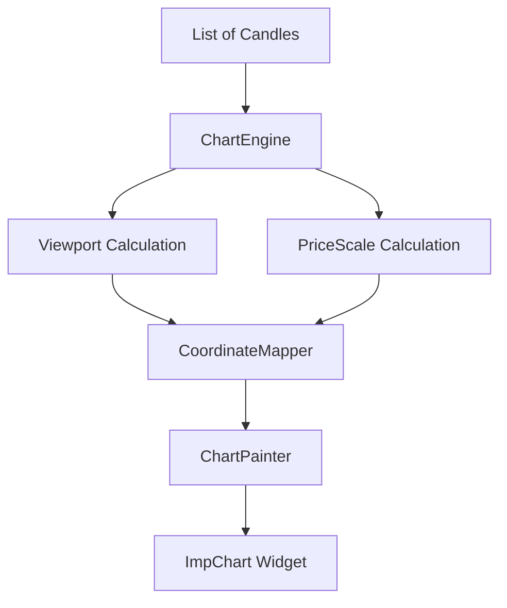

# Architecture Documentation

## Engine-First Philosophy
`imp_trading_chart` is built as a **rendering engine**, not just a collection of Flutter widgets. This separation ensures that the core logic (scaling, viewports, coordinate mapping) is decoupled from the Flutter widget tree, allowing for high-performance updates and a cleaner codebase.

## Data Flow

### 1. ChartEngine
The `ChartEngine` is the brain of the package. It holds the immutable state of the chart, including the full list of candles and the current viewport.
- **Immutability**: Every update creates a new engine instance, making the state predictable and easy to reason about.
- **Caching**: It caches the `PriceScale` to avoid recalculating min/max prices on every frame unless the viewport changes.

### 2. Viewport (`ChartViewport`)
The viewport defines exactly which portion of the data is currently visible on the screen.
- **startIndex**: The first visible candle's index.
- **visibleCount**: How many candles are shown at once.
- **Performance**: By only rendering the visible slice of data, we keep the frame rate high even with thousands of candles.

### 3. PriceScale
The `PriceScale` maps price values to a vertical range (0.0 to 1.0).
- **Padding**: It includes a configurable padding percentage so that candles don't touch the top or bottom edges.
- **Inversion**: Financial charts typically have higher prices at the top, so the mapping is inverted relative to standard screen coordinates.

### 4. Rendering Pipeline
The rendering is handled by the `ChartPainter`, a `CustomPainter` that uses the `CoordinateMapper` to translate data points (index, price) into screen pixels (X, Y).
- **CoordinateMapper**: A bridge that takes the viewport and price scale and computes exact X and Y offsets.
- **Stateless Painting**: The painter itself holds no state; it simply receives a mapper and draws what it's told.

## Why Immutability & Caching?
- **Immutability**: Prevents side effects and makes it easier to implement features like undo/redo or state comparison. In Flutter, it perfectly aligns with the `didUpdateWidget` lifecycle.
- **Caching**: Calculating the min/max price for a viewport requires iterating over all visible candles. Caching this result ensures that as long as the viewport doesn't move, the rendering is extremely fast.
